<div align="center">


<a href="#-overview">
  
</a>

<br/>


<br/>


<br/><br/>

<b>
<a href="#-overview">Overview</a> ·
<a href="#-screenshots">Screenshots</a> ·
<a href="#-system-architecture">Architecture</a> ·
<a href="#-model-performance">Results</a> ·
<a href="#-getting-started">Getting Started</a> ·
<a href="#-project-structure">Structure</a> ·
<a href="#-author">Author</a>
</b>

</div>

<br/>

<p align="center">
  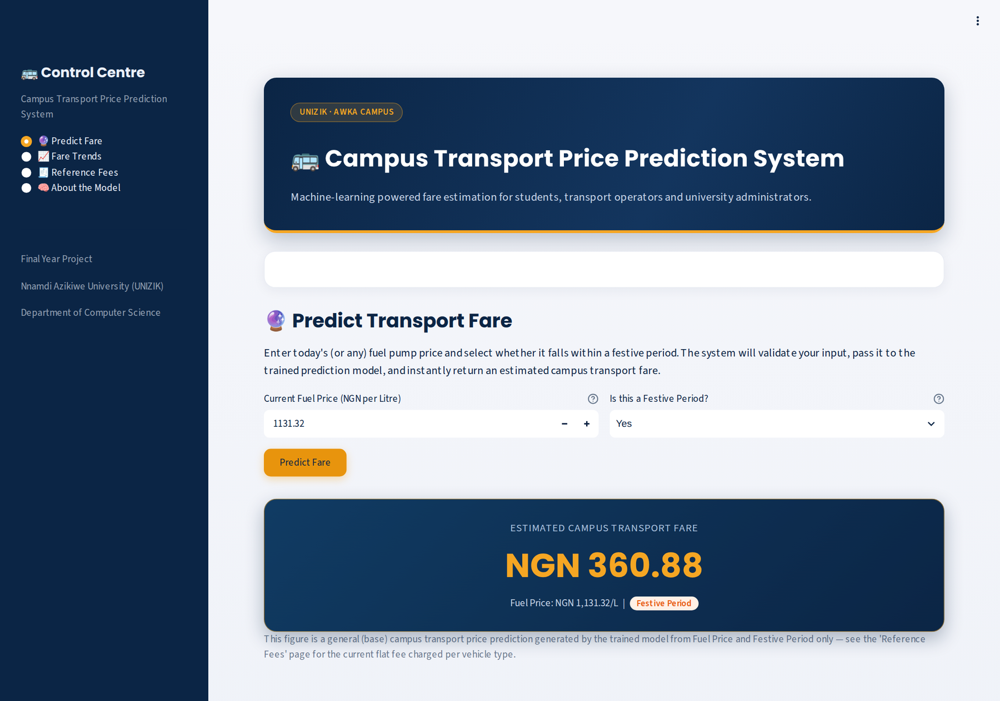
</p>

---

## 📖 Overview

At **Nnamdi Azikiwe University (UNIZIK), Awka**, campus transport fares are set by hand. The Directorate of Transport, the Students' Union Government and the transport operators meet to review fares, but only *after* fuel prices have already moved. Students can't see increases coming, and the way prices are decided isn't transparent.

The **Campus Transport Price Prediction System** replaces that guesswork with a machine-learning estimate. Enter today's **fuel pump price (₦/litre)** and say whether it is a **festive period**, and a trained **Random Forest Regressor** returns the expected campus transport fare right away. It runs as a clean, four-page **Streamlit** web app.

<table>
<tr>
<td width="33%" valign="top">

**🎓 For students**<br/>
Know what transport will cost before prices change, and budget for it.

</td>
<td width="33%" valign="top">

**🚐 For operators & union executives**<br/>
An objective, data-backed reference point for fare discussions.

</td>
<td width="33%" valign="top">

**🏛 For university management**<br/>
A transparent, evidence-based alternative to the fully manual fare review.

</td>
</tr>
</table>

> [!NOTE]
> The system is a **decision-support tool**, not an automatic fare-setting authority. It is meant to run alongside the existing fare-review process so its predictions can be checked against real, manually set fares.

---

## 🎯 Problem Statement & Objectives

**The problems this project addresses:**

1. Transport prices on the UNIZIK campus shift unpredictably, because petrol (PMS) prices are volatile.
2. Students have no way to estimate what they will spend on transport based on their travel patterns.

**Aim:** develop a localized Campus Transport Price Prediction System, using machine learning, that reduces the arbitrariness of transport fares.

| # | Objective | Status |
|:-:|:--|:-:|
| 1 | Collect and preprocess a localized dataset with campus-specific variables: fuel price, year, flat fees and festive period | ✅ |
| 2 | Build, implement and compare **Linear Regression** (baseline) and **Random Forest** (ensemble) models | ✅ |
| 3 | Evaluate and validate the system's accuracy and reliability using **Mean Absolute Error (MAE)** | ✅ |

---

## ✨ Key Features

| | Feature | What it does |
|:-:|:--|:--|
| 🔮 | **Instant fare prediction** | Enter a fuel price and pick the festive status to get an estimated fare in Naira |
| 🛡 | **Input validation** | Rejects zero, negative or unrealistic prices, and warns when a price falls well outside the training range (extrapolation) |
| 📈 | **Historical trend explorer** | Plots transport price against fuel price from 2016 to 2026, marks festive months and includes an expandable data table |
| 🧾 | **Reference fees** | Shows the current flat fee for the 17-seater bus, the 7-seater shuttle and the Keke (tricycle) |
| 🧠 | **Model transparency** | Shows the MAE / MSE / RMSE / R² comparison and explains why the deployed model was chosen |
| ⚖ | **Automatic model selection** | Training script picks the model with the lowest MAE and saves it for the app |
| 📓 | **Reproducible notebook** | A step-by-step Jupyter notebook trains everything from scratch, runs a live prediction demo and launches the app |
| 🎨 | **Custom UI** | Navy and amber theme, hero banner, result cards and fee chips, all in a single injected stylesheet |

---

## 📸 Screenshots

<table>
  <tr>
    <td width="50%" align="center">
      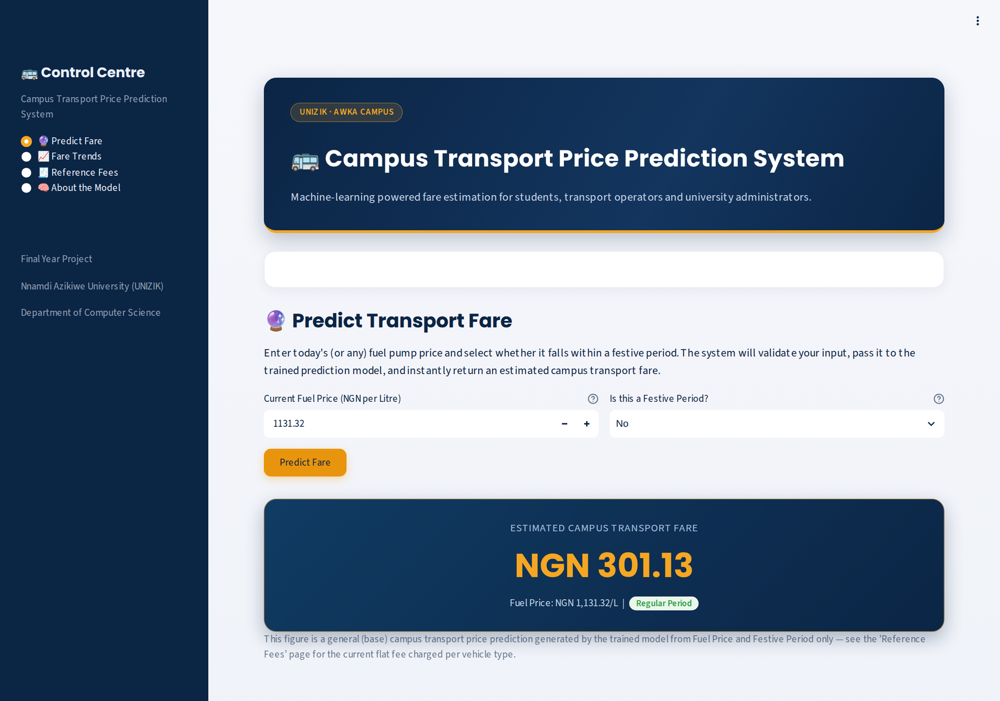<br/>
      <sub><b>🔮 Predict Fare</b>: regular period, ₦1,131.32/L → <b>₦301.13</b></sub>
    </td>
    <td width="50%" align="center">
      <br/>
      <sub><b>🎉 Festive surge</b>: same fuel price, festive period → <b>₦360.88</b></sub>
    </td>
  </tr>
  <tr>
    <td width="50%" align="center">
      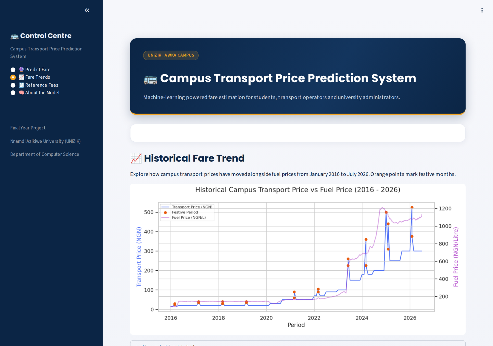<br/>
      <sub><b>📈 Fare Trends</b>: fare vs fuel price, 2016–2026</sub>
    </td>
    <td width="50%" align="center">
      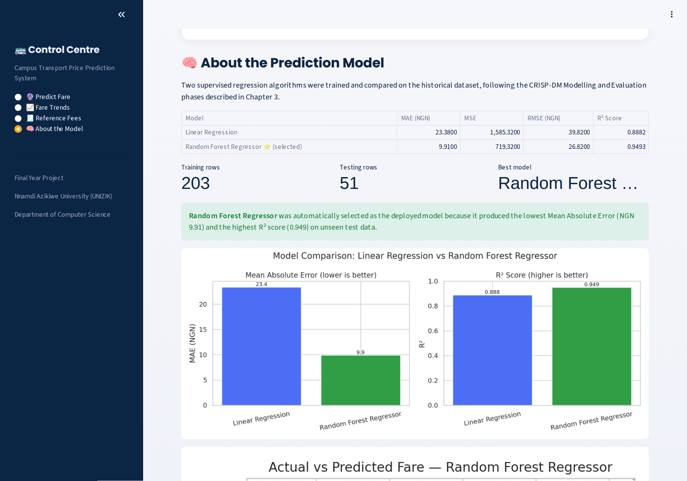<br/>
      <sub><b>🧠 About the Model</b>: metrics and evaluation charts</sub>
    </td>
  </tr>
  <tr>
    <td colspan="2" align="center">
      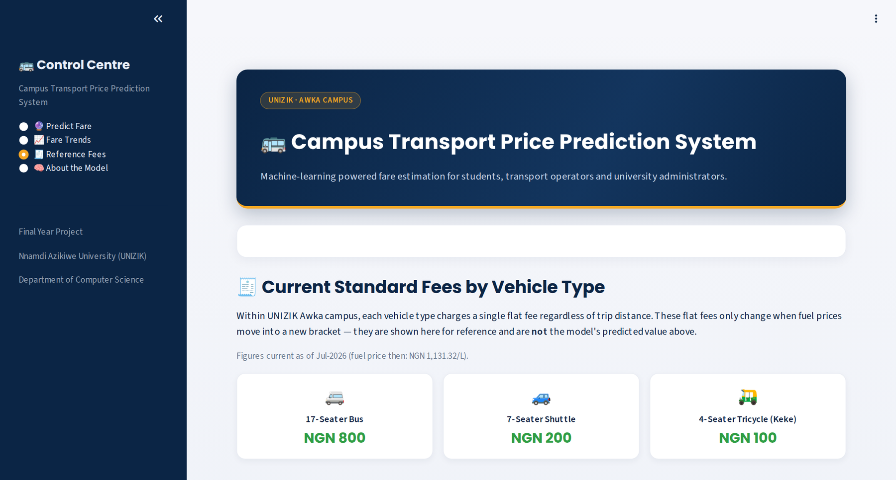<br/>
      <sub><b>🧾 Reference Fees</b>: current flat fee per vehicle type (as of Jul 2026)</sub>
    </td>
  </tr>
</table>

---

## 🧩 System Architecture

The app follows a **modular architecture**. Input handling, validation, prediction and output are separate components, so any one of them can be improved without touching the rest.

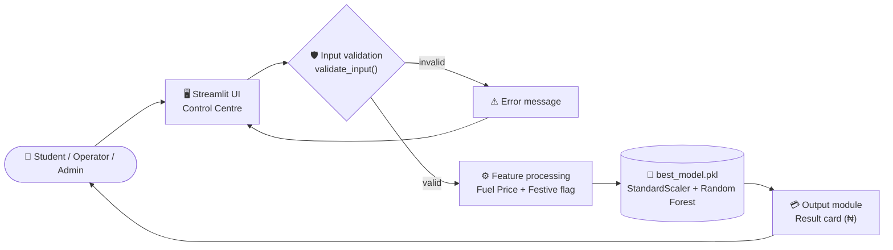

### 🔁 Prediction flow

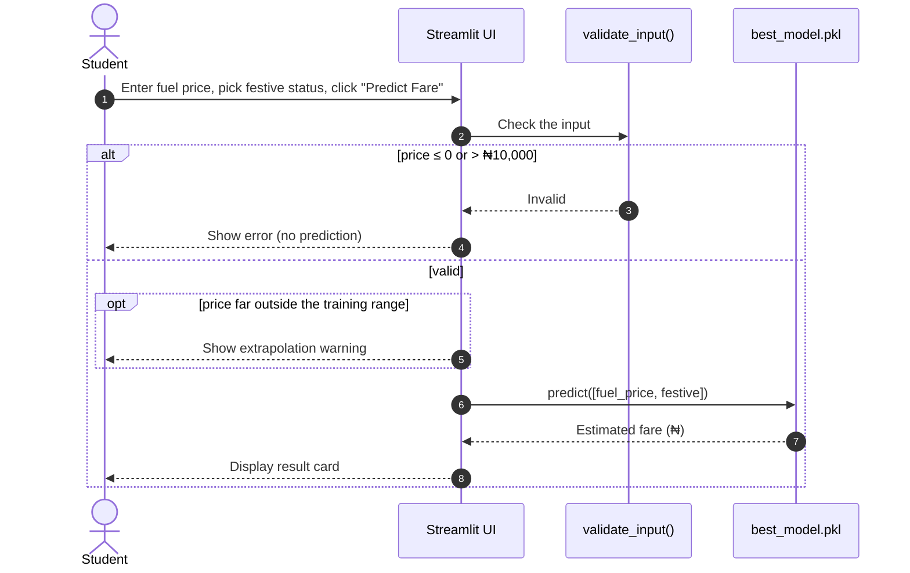

### 🧭 Control Centre & subsystems

The sidebar **Control Centre** routes to four subsystems:

| Page | Subsystem | Function in `app.py` |
|:--|:--|:--|
| 🔮 Predict Fare | User input and prediction | `page_predict()` |
| 📈 Fare Trends | Historical trend visualization | `page_trends()` |
| 🧾 Reference Fees | Reference fee information | `page_reference()` |
| 🧠 About the Model | Model information and evaluation | `page_about()` |

<details>
<summary><b>📐 View the full system flowchart</b></summary>
<br/>
<p align="center">
  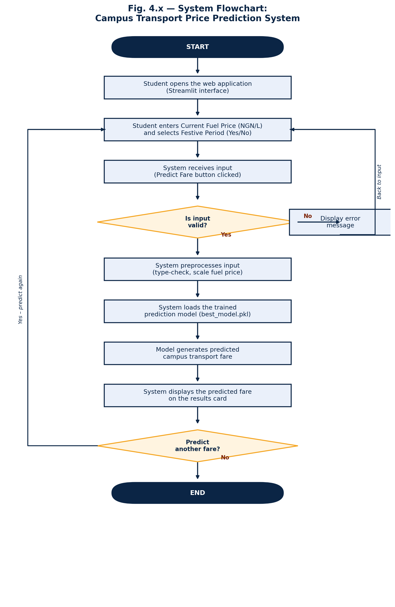
</p>

Regenerate it at any time with `python generate_flowchart.py`.
</details>

---

## 🔬 Methodology

The project uses a hybrid **CRISP-DM + Agile** methodology. **CRISP-DM** governs the machine-learning pipeline, and **Agile** governs the iterative build of the web interface.

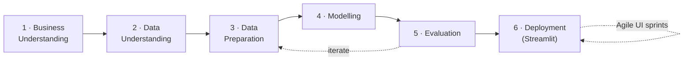

| CRISP-DM phase | What was done in this project |
|:--|:--|
| Business understanding | Studied UNIZIK's manual, negotiation-based fare-review process |
| Data understanding | Cross-referenced transport union records with verified Nigerian PMS pump prices |
| Data preparation | `load_and_preprocess_data()`: removed duplicates and missing values, parsed dates, fixed data types |
| Modelling | `train_and_evaluate()`: trained Linear Regression and Random Forest inside scikit-learn Pipelines |
| Evaluation | Compared MAE, MSE, RMSE and R² on a held-out 20% test set |
| Deployment | Serialized the best pipeline with `joblib` and served it through `app.py` |

---

## 📊 Dataset

**File:** `data/campus_transport_dataset.csv`. It holds **254 observations** covering **127 months (Jan 2016 – Jul 2026)**, built from transport union records and verified PMS pump-price data.

| Column | Type | Range | Description |
|:--|:--|:--|:--|
| `Year` | String → Date | Jan-2016 – Jul-2026 | Month and year of the observation (used for sorting and trend charts only) |
| `Fuel_Price_NGN_per_Litre` | Float | ₦86.15 – ₦1,213.84 | PMS pump price that month · **Predictor 1** |
| `Festive_Period` | Integer (0/1) | 0 or 1 | 1 if the month falls within a festive period · **Predictor 2** |
| `Transport_Price_NGN` | Float | ₦15 – ₦525 | General campus transport price · **🎯 Target** |
| `Fee_Bus_17Seater_NGN` | Integer | ₦100 – ₦800 | Flat fee, 17-seater bus (reference only) |
| `Fee_ShuttleBus_7Seater_NGN` | Integer | ₦30 – ₦200 | Flat fee, 7-seater shuttle (reference only) |
| `Fee_Tricycle_4Seater_NGN` | Integer | ₦15 – ₦100 | Flat fee, 4-seater tricycle / Keke (reference only) |

> [!TIP]
> **Why only two predictors?** Every vehicle type on UNIZIK's campus charges **one flat fee regardless of distance**, so trip distance tells the model nothing. Field research found that **fuel price** and **festive-period status** are what actually drive fare changes. Using only these two keeps the model simple and avoids overfitting to noise.

---

## 🤖 Machine Learning Models

Both models are wrapped in a scikit-learn `Pipeline` with a `StandardScaler`, so **one saved file handles both preprocessing and prediction**.

```python
candidate_models = {
    "Linear Regression": Pipeline([
        ("scaler", StandardScaler()),
        ("model",  LinearRegression()),
    ]),
    "Random Forest Regressor": Pipeline([
        ("scaler", StandardScaler()),
        ("model",  RandomForestRegressor(n_estimators=300, max_depth=8, random_state=42)),
    ]),
}
```

<table>
<tr>
<td width="50%" valign="top">

#### 📏 Linear Regression (baseline)
Fits a straight-line relationship between the predictors and the fare:

```math
\hat{y} = \beta_0 + \beta_1 x_1 + \beta_2 x_2
```

where $x_1$ is fuel price and $x_2$ is the festive flag.

</td>
<td width="50%" valign="top">

#### 🌲 Random Forest (ensemble)
Averages **T = 300** decision trees, each trained on a bootstrap sample:

```math
\hat{y} = \frac{1}{T}\sum_{i=1}^{T} t_i(x)
```

This captures non-linear jumps, such as festive surges and fuel-price brackets.

</td>
</tr>
</table>

<details>
<summary><b>🧮 Evaluation metrics (formulas)</b></summary>
<br/>

```math
\text{MAE} = \frac{1}{n}\sum_{i=1}^{n}\lvert y_i-\hat{y}_i\rvert
\qquad
\text{MSE} = \frac{1}{n}\sum_{i=1}^{n}(y_i-\hat{y}_i)^2
```

```math
\text{RMSE} = \sqrt{\text{MSE}}
\qquad
R^2 = 1-\frac{\sum_{i}(y_i-\hat{y}_i)^2}{\sum_{i}(y_i-\bar{y})^2}
```

| Metric | What it measures |
|:--|:--|
| **MAE** | Average prediction error in Naira (lower is better) |
| **MSE** | Like MAE, but squares each error, so large mistakes count more |
| **RMSE** | Square root of MSE, back in Naira |
| **R²** | Share of the variation in fares the model explains (0 to 1, higher is better) |

</details>

### ⚙ Training pipeline

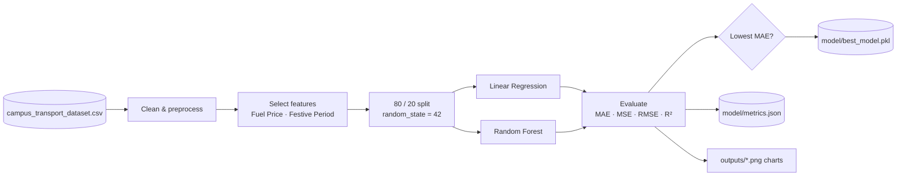

---

## 📈 Model Performance

Both models were evaluated on **51 held-out test rows** that neither model saw during training (**203** rows were used for training).

| Model | MAE (₦) ↓ | MSE ↓ | RMSE (₦) ↓ | R² ↑ |
|:--|:-:|:-:|:-:|:-:|
| Linear Regression | 23.38 | 1,585.32 | 39.82 | 0.888 |
| **🏆 Random Forest Regressor** | **9.91** | **719.32** | **26.82** | **0.949** |

> [!IMPORTANT]
> The **Random Forest Regressor** was selected automatically and deployed. It **cut the average error by about 58%** (₦23.38 → ₦9.91) and explains **~95%** of the variation in campus fares. This confirms that UNIZIK fares don't move in a simple straight line with fuel price. Festive surges and fuel-price brackets add non-linear effects that the ensemble captures much better.

<table>
  <tr>
    <td width="55%" align="center">
      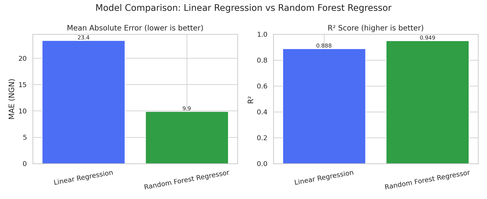<br/>
      <sub>MAE and R²: Linear Regression vs Random Forest</sub>
    </td>
    <td width="45%" align="center">
      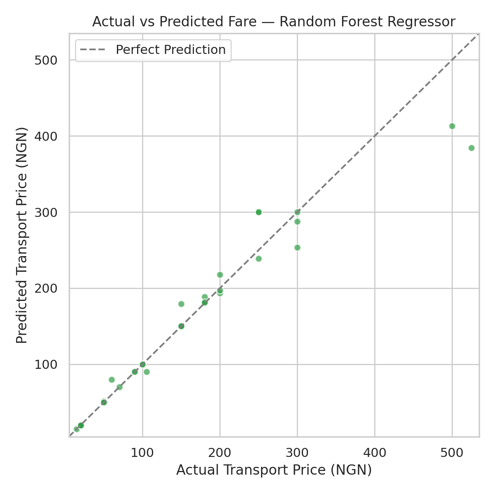<br/>
      <sub>Actual vs predicted fare on the test set</sub>
    </td>
  </tr>
  <tr>
    <td width="55%" align="center">
      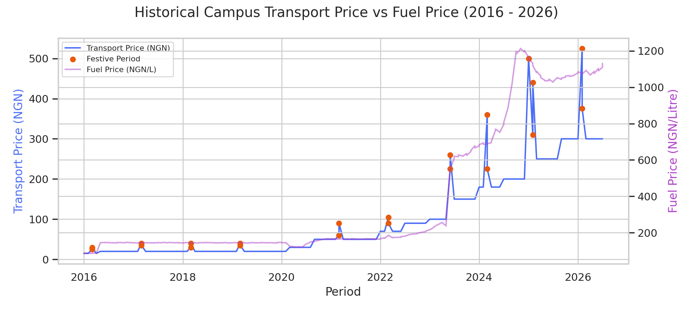<br/>
      <sub>Transport price vs fuel price, 2016–2026 (orange = festive)</sub>
    </td>
    <td width="45%" align="center">
      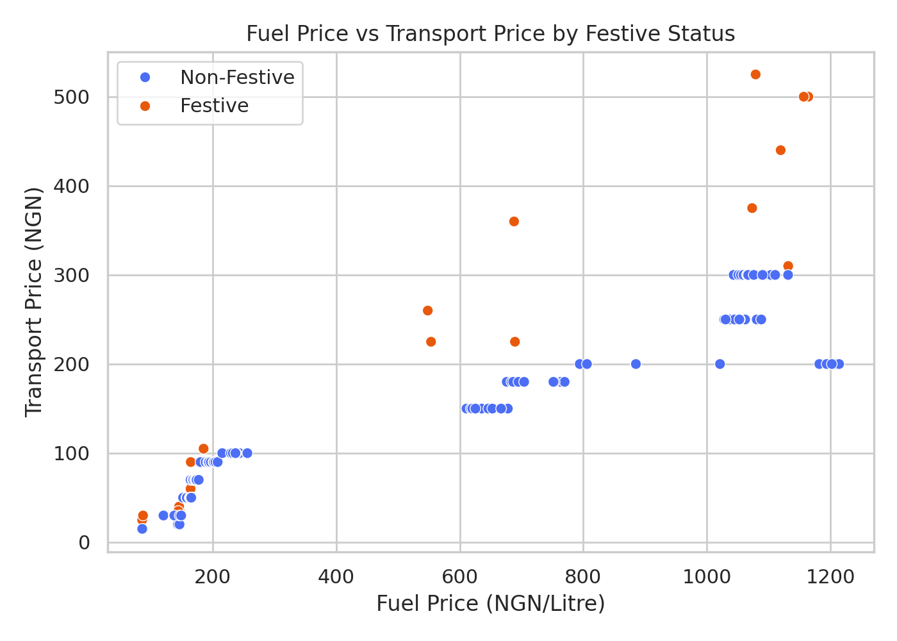<br/>
      <sub>Fuel price vs transport price by festive status</sub>
    </td>
  </tr>
</table>

### 🔎 Sample predictions (deployed model)

| Fuel price (₦/L) | Regular period | Festive period |
|:-:|:-:|:-:|
| 165.00 | ₦50.33 | ₦75.40 |
| 650.00 | ₦150.10 | ₦277.47 |
| 1,000.00 | ₦217.61 | ₦309.17 |
| 1,131.32 | ₦301.13 | ₦360.88 |

---

## 🚀 Getting Started

### ✅ Prerequisites

- **Python 3.10+** ([download](https://www.python.org/downloads/)). On Windows, tick **"Add python.exe to PATH"** during installation.
- **pip** (comes with Python)
- **Jupyter Lab** (optional, but it's the main way the project is run): `pip install jupyterlab`

### 1️⃣ Clone the repository

```bash
git clone https://github.com/YOUR-USERNAME/campus-transport-price-prediction.git
cd campus-transport-price-prediction
```

### 2️⃣ Install the dependencies

```bash
pip install -r requirements.txt
```

<details>
<summary><b>🐍 Optional: use a virtual environment</b></summary>
<br/>

```bash
python -m venv venv

# Windows
venv\Scripts\activate
# macOS / Linux
source venv/bin/activate

pip install -r requirements.txt
```

To use the virtual environment inside Jupyter Lab, register it as a kernel:

```bash
pip install ipykernel
python -m ipykernel install --user --name=campus_transport --display-name "Python (Campus Transport)"
```

Then choose **Kernel → Change Kernel… → Python (Campus Transport)** in Jupyter Lab.
</details>

### 3️⃣ Train the model and run the app

#### 📓 Option A: Jupyter Lab (primary)

```bash
jupyter lab
```

1. Open **`Campus_Transport_Model_Training.ipynb`**.
2. Run **Step 0** to check your environment. If anything is missing, install it from a cell:
   ```python
   %pip install pandas numpy scikit-learn matplotlib seaborn joblib streamlit
   ```
3. Press <kbd>Shift</kbd> + <kbd>Enter</kbd> to run each cell in order. This trains both models and saves the best one.
4. Launch the app from **File → New → Terminal** with `streamlit run app.py`, or run the notebook's **Step 14** cell.

#### 💻 Option B: Terminal

```bash
# 1. Train both models and save the best one
python train_model.py

# 2. Launch the web app
streamlit run app.py
```

The app opens at **http://localhost:8501**. Press <kbd>Ctrl</kbd> + <kbd>C</kbd> in the terminal to stop it.

> [!NOTE]
> The repository already includes a trained model in `model/`, so you can run `streamlit run app.py` straight away. Retrain whenever you change the dataset.

<details>
<summary><b>🖨 Expected training output</b></summary>
<br/>

```text
Loading and preprocessing dataset...
Dataset ready: 254 rows after cleaning.

============================================================
MODEL TRAINING COMPLETE
============================================================
Linear Regression:
    MAE  = NGN 23.38
    MSE  = 1585.32
    RMSE = NGN 39.82
    R2   = 0.8882
Random Forest Regressor:  <-- SELECTED (best)
    MAE  = NGN 9.91
    MSE  = 719.32
    RMSE = NGN 26.82
    R2   = 0.9493
============================================================
Best model saved to: model/best_model.pkl
Metrics saved to:    model/metrics.json

Generating charts...
Charts saved to: outputs/

All done. You can now run the Streamlit app with:
    streamlit run app.py
```
</details>

---

## 🧭 Using the App

1. Click **🔮 Predict Fare** in the Control Centre (it's selected by default).
2. Type or adjust the **Current Fuel Price (NGN per Litre)**.
3. Choose **Yes** or **No** for *Is this a Festive Period?*
4. Click **Predict Fare**.
5. Read the estimated fare on the result card. Your inputs are shown underneath.

| Direction | Field | Format | Validation |
|:--|:--|:--|:--|
| ⬇ Input | Fuel Price | Decimal (₦/L) | Must be > 0 and ≤ ₦10,000; warns if far outside ₦86 – ₦1,214 |
| ⬇ Input | Festive Period | "Yes" / "No" → 1 / 0 | Fixed dropdown, so it can't be invalid |
| ⬆ Output | Predicted fare | Decimal (₦), 2 d.p. | Generated by the system |

> [!WARNING]
> Random Forest predictions level off beyond the range of the training data. Treat predictions for fuel prices far outside **₦86 – ₦1,214/L** as rough estimates. The app shows a warning in these cases.

---

## 📁 Project Structure

```text
campus-transport-price-prediction/
├── app.py                                      # Streamlit web application (4 subsystems)
├── train_model.py                              # Preprocessing, training, evaluation, model selection
├── generate_flowchart.py                       # Draws the system flowchart (outputs/system_flowchart.png)
├── Campus_Transport_Model_Training.ipynb       # Step-by-step notebook version of the pipeline
├── requirements.txt                            # Python dependencies
├── README.md
├── data/
│   └── campus_transport_dataset.csv            # 254-row historical dataset (2016–2026)
├── model/                                      # Generated by train_model.py or the notebook
│   ├── best_model.pkl                          # Deployed pipeline (scaler + Random Forest)
│   ├── linear_regression.pkl
│   ├── random_forest_regressor.pkl
│   ├── metrics.json                            # MAE / MSE / RMSE / R² for both models
│   ├── reference_fees.json                     # Latest flat fee per vehicle type
│   └── clean_dataset.csv                       # Cleaned data with parsed dates
├── outputs/                                    # Charts generated during training
│   ├── model_comparison.png
│   ├── actual_vs_predicted.png
│   ├── fare_trend_history.png
│   ├── feature_relationship.png
│   └── system_flowchart.png
├── assets/
│   └── screenshots/                            # App screenshots used in this README
└── .streamlit/
    └── config.toml                             # Navy & amber app theme
```

<details>
<summary><b>🧱 Program module specification</b></summary>
<br/>

| Module | Key function(s) | Purpose |
|:--|:--|:--|
| `train_model.py` | `load_and_preprocess_data()` | Loads the CSV, removes duplicates and missing values, parses dates, fixes data types |
| | `train_and_evaluate()` | Splits the data, trains both pipelines, computes metrics, selects and saves the best model |
| | `generate_charts()` | Produces the comparison, actual-vs-predicted, trend and relationship charts |
| | `build_reference_fee_table()` | Extracts the latest flat fee per vehicle type |
| `app.py` | `load_model()` · `load_metrics()` · `load_clean_dataset()` | Cached loaders (`@st.cache_resource` / `@st.cache_data`) |
| | `validate_input()` | Checks that the fuel price is valid and realistic |
| | `page_predict()` · `page_trends()` · `page_reference()` · `page_about()` | Render the four subsystems |
| | `main()` | Builds the Control Centre sidebar and routes between pages |
| `generate_flowchart.py` | `terminal()` · `process()` · `decision()` · `arrow()` | Draws the standard-symbol system flowchart |

</details>

<details>
<summary><b>📓 Notebook walkthrough</b></summary>
<br/>

| Step | What it does |
|:--|:--|
| **0**: Environment check | Confirms every required library is installed |
| **1–3**: Load & clean | Loads the 254-row dataset and cleans it |
| **4**: Visual exploration | Charts the festive-period effect |
| **5–8**: Train both models | Linear Regression and Random Forest, with printed metrics |
| **9**: Comparison | Side-by-side metrics table and chart |
| **10**: Save best model | Writes `model/best_model.pkl` for the app to load |
| **11–12**: Evaluation charts | Actual vs predicted, and the historical trend |
| **13**: 🎯 Live prediction | Edit a fuel price in the cell and re-run for an instant fare |
| **14**: Launch the app | Starts the Streamlit server from the notebook (the next cell stops it) |

</details>

---

## 🧰 Tech Stack

<div align="center">

| Layer | Technology |
|:--|:--|
| **Language** |  |
| **Web framework** |  |
| **Machine learning** |  |
| **Data handling** |   |
| **Visualization** |   |
| **Model persistence** |  |
| **Development environment** |  |
| **Storage** | Flat files: CSV · JSON · `.pkl` (no database needed) |

</div>

---

## 💻 System Requirements

| 🖥 Hardware | Minimum | Recommended |
|:--|:--|:--|
| Processor | Dual-core, 1.6 GHz | Quad-core, 2.0 GHz or better |
| RAM | 4 GB | 8 GB or more |
| Storage | 500 MB free | 1 GB free |
| Internet | Only for the one-time package install | — |

| 🧩 Software | Version |
|:--|:--|
| Operating system | Windows 10/11, macOS 12+, or Linux |
| Python | 3.10 or later |
| Web browser | Chrome, Edge, Firefox or Safari |
| Development tool | Jupyter Lab |
| Python packages | `streamlit` `pandas` `numpy` `scikit-learn` `matplotlib` `seaborn` `joblib` (see `requirements.txt`) |

---

## 🩺 Troubleshooting

<details>
<summary><b>Click to expand common issues and fixes</b></summary>
<br/>

| Problem | Likely cause | Fix |
|:--|:--|:--|
| App shows *"Model files not found"* | App launched before the model was trained | Run `python train_model.py` (or the notebook), then restart the app |
| `ModuleNotFoundError` in a notebook | Package installed into a different Python/kernel | Run `%pip install <package>` in a cell, then **Kernel → Restart Kernel** |
| `'python' is not recognized` | Python not added to PATH | Reinstall and tick **Add python.exe to PATH**, or use `py` |
| `'jupyter' is not recognized` | Jupyter not on PATH | Use `python -m jupyterlab` |
| Dataset warning in the notebook | Jupyter Lab started from the wrong folder | Close it and relaunch from the project root |
| Charts missing on Trends/About pages | `outputs/` folder missing | Re-run the training step to regenerate them |
| Predictions unchanged after editing data | Stale `best_model.pkl` | Retrain to overwrite the saved model |
| *"Address already in use"* | Another Streamlit session is running | Close it, or run `streamlit run app.py --server.port 8502` |
| Browser doesn't open | Default browser setting | Visit **http://localhost:8501** manually |

**FAQ**

- **Does it need internet after setup?** No. It runs fully on `localhost`. Only the decorative Google Fonts need a connection, and the app falls back to system fonts without one.
- **Can I change the colours or text?** Yes. All styling is in the `CUSTOM_CSS` string at the top of `app.py`, and the page text lives in each `page_…()` function.
- **How do I add new data?** Append rows to `data/campus_transport_dataset.csv` in the same format and retrain.

</details>

---

## 🚧 Limitations

- **Two predictors only.** Time of day, weather, route and passenger volume are not modelled.
- **Manual input.** Fuel price is typed in and festive status is picked by hand; there is no live data feed.
- **No automated retraining.** The model is retrained by running the script or notebook manually.
- **Flat-file storage.** No database, user accounts or saved prediction history.
- **Local deployment.** The app runs on `localhost` and is not publicly hosted.
- **Single campus.** Trained and validated only on UNIZIK Awka data.
- **Two algorithms compared.** Gradient boosting and time-series models were out of scope.

## 🔭 Future Work

- [ ] Add features such as inflation indices, time-of-day demand and weather
- [ ] Benchmark **XGBoost**, **ARIMA** and **LSTM** against the current models
- [ ] Pull fuel prices from a live feed and derive festive status from the academic calendar
- [ ] Automated retraining and model-drift monitoring
- [ ] Validate on data from other Nigerian university campuses
- [ ] Offer **USSD/SMS** access or a native mobile app for low-bandwidth users
- [ ] Host publicly (e.g. Streamlit Community Cloud or university servers)

---

## 🎓 Author

<div align="center">

<table>
<tr>
<td align="center" width="100%">

### Emesiana Thankgod Chibuzor

**B.Sc. Computer Science, Final Year Project (September 2026)**<br/>
Department of Computer Science · Faculty of Physical Sciences<br/>
**Nnamdi Azikiwe University (UNIZIK), Awka**, Anambra State, Nigeria

<br/>

| Role | Name |
|:--|:--|
| 🧑‍🏫 Supervisor I | **Prof. S. Okide** |
| 🧑‍🏫 Supervisor II | **Mr. Prince Azubuike** |
| 🏛 Head of Department | Prof. Ikechukwu I. Umeh |

</td>
</tr>
</table>

</div>

### 🙏 Acknowledgements

Many thanks to my supervisors for their guidance and corrections, to the lecturers and staff of the Department of Computer Science, UNIZIK, and to the UNIZIK transport operators and union members whose records made the dataset possible.

### 📚 Citation

If you reference this work, please cite:

```bibtex
@thesis{emesiana2026campustransport,
  author      = {Emesiana, Thankgod Chibuzor},
  title       = {Development of a Campus Transport Price Prediction System Using Machine Learning Models},
  type        = {B.Sc. Project},
  institution = {Department of Computer Science, Nnamdi Azikiwe University},
  address     = {Awka, Nigeria},
  year        = {2026},
  month       = {September}
}
```

---

<div align="center">

**If this project helped you, consider giving it a ⭐**

<sub>Built with 🐍 Python · 🤖 scikit-learn · 🎈 Streamlit, for the students of UNIZIK</sub>


</div>
